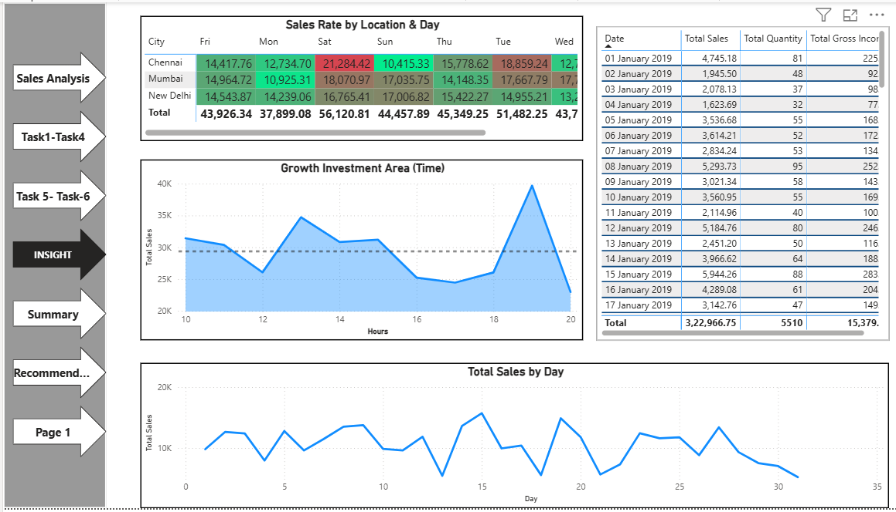

# 📊 Sales Analysis Dashboard (Power BI)

## 📌 Project Overview

This project presents an interactive **Sales Analysis Dashboard** built using Power BI to explore sales performance across different dimensions such as time, location, product line, and customer segments.

The dashboard helps identify key trends, peak sales periods, and high-performing product categories, enabling better business decision-making and strategic planning.

---

## 🎯 Business Objective

The goal of this project is to analyze sales data to:

* Understand sales trends over time (monthly, daily, hourly)
* Identify top-performing product lines
* Analyze customer behavior (gender & membership type)
* Detect peak sales periods and locations
* Provide actionable insights and recommendations for revenue growth

---

## 🛠️ Tools Used

* Power BI
* Data Visualization
* Data Cleaning & Transformation
* DAX (for calculated metrics)

---

## 📊 Dashboard Highlights

### 🧾 Overall Performance

* Total Sales, Quantity, Profit, and Ratings overview
* High-level KPIs for quick business understanding

---

### 📅 Sales Trends Analysis

* Monthly sales comparison
* Hourly sales distribution (peak hours identified)

---

### 📈 Product & Weekly Insights

* Sales by product line
* Peak sales days of the week

---

### 👥 Customer & Location Insights

* Sales by gender and product line
* Sales distribution across cities

---

### 🔍 Key Insights

* Peak revenue hours identified
* Growth opportunities highlighted
* Location-based performance comparison

---

## 📌 Key Findings

* 📈 **Peak Sales Time:** Afternoon to evening hours (1 PM – 8 PM)
* 📅 **Best Performing Day:** Saturday shows highest sales
* 🏥 **Top Product Line:** Cardiology generates highest revenue
* 👥 **Customer Insight:** Male customers contribute more in certain segments
* 📍 **Location Insight:** Sales vary significantly across cities

---

## 💡 Business Recommendations

* 🎯 Focus marketing during peak hours (1 PM – 8 PM)
* 📊 Invest more in high-performing categories like **Cardiology**
* 📉 Improve performance of low-performing areas like **ENT**
* 👥 Target specific customer segments (gender-based insights)
* 📍 Optimize strategies based on city-wise performance

---

## 🚀 How to Use

1. Download the `.pbix` file
2. Open it in Power BI Desktop
3. Interact with filters (City, Month)
4. Navigate between pages using buttons

---

## ✨ Conclusion

This dashboard provides a comprehensive view of sales performance and helps in identifying trends, patterns, and opportunities for growth. It enables data-driven decision-making through clear visual insights.

---

## ⭐ If you like this project

Give it a ⭐ on GitHub!
